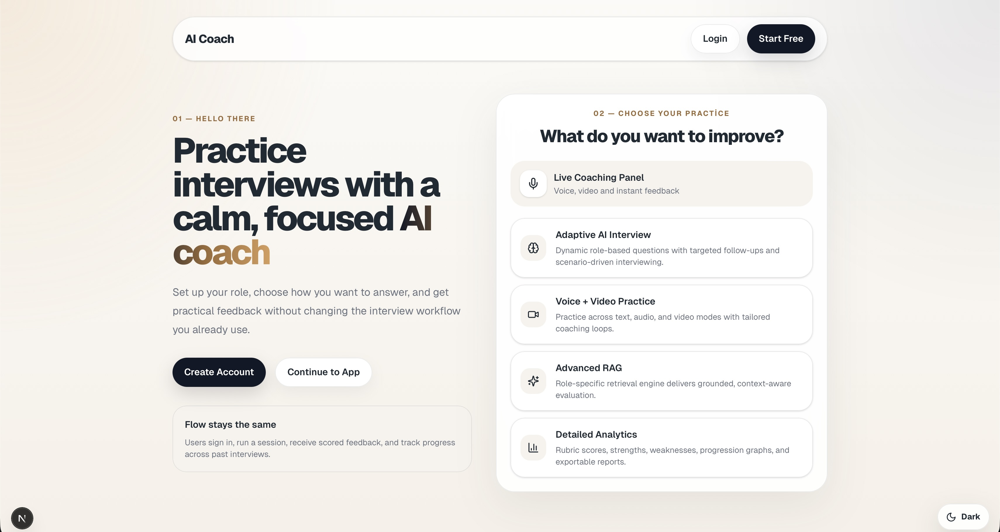
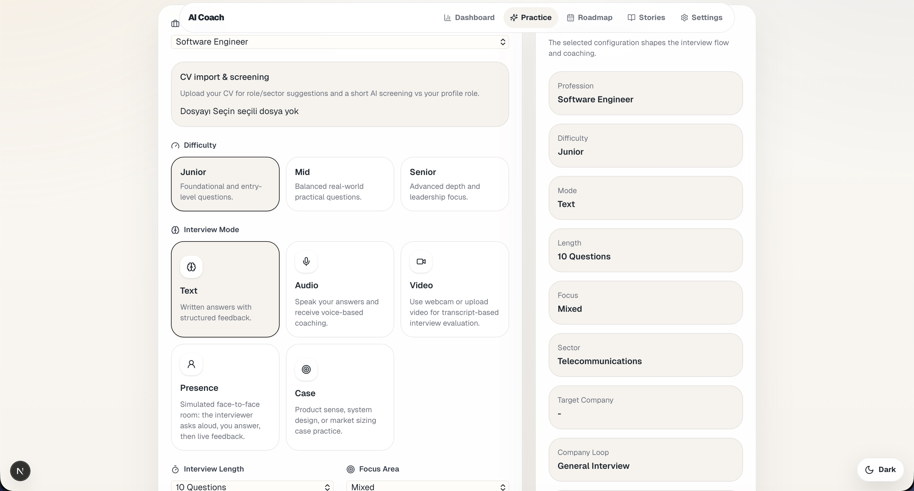
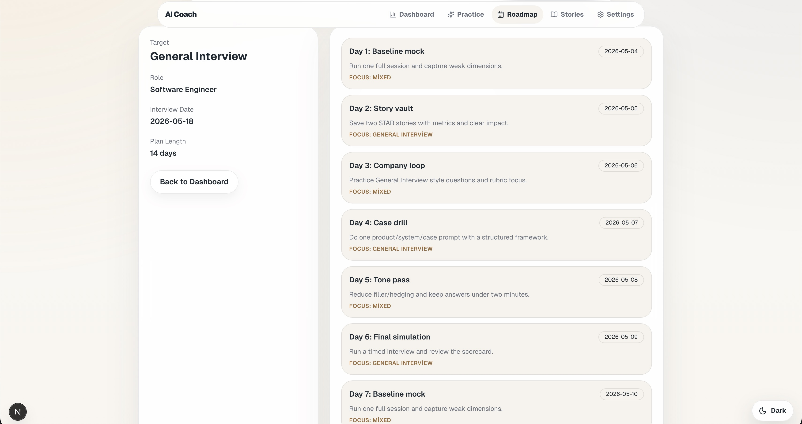

# AI Coach App

AI Coach App, CV ve hedef role gore yapay zeka destekli mulakat simulasyonu sunan bir full-stack mulakat pratik uygulamasidir.

## Screenshots

### Home



### Dashboard


### Practice Hub


### Interview Setup



### Roadmap



### Settings


## Project Structure

- `frontend/`: Next.js + React + TypeScript tabanli istemci
- `backend/`: FastAPI tabanli API
- `aicoachapp.plan.md`: Yol haritasi ve teknik plan
- `Jiraiçinplanlama.md`: Epic/Story/Task kirilimi
- `upschool301prdmvpdocument.md`: PRD dokumani

## Backend Setup

```bash
cd backend
python3 -m venv .venv
source .venv/bin/activate
pip install -r requirements.txt
cp .env.example .env
uvicorn app.main:app --reload
```

Backend varsayilan olarak `http://127.0.0.1:8000` uzerinde calisir.

### Backend Health Endpoints

- `GET /health`
- `GET /health/live`
- `GET /health/ready`

## Frontend Setup

```bash
cd frontend
npm install
cp .env.example .env
npm run dev
```

Frontend varsayilan olarak `http://localhost:3000` uzerinde calisir.

## Quick Start

Iki terminal ac:

1. Backend'i baslat (`uvicorn app.main:app --reload`)
2. Frontend'i baslat (`npm run dev`)

Frontend acildiginda backend health durumunu ana ekranda gorebilirsin.
